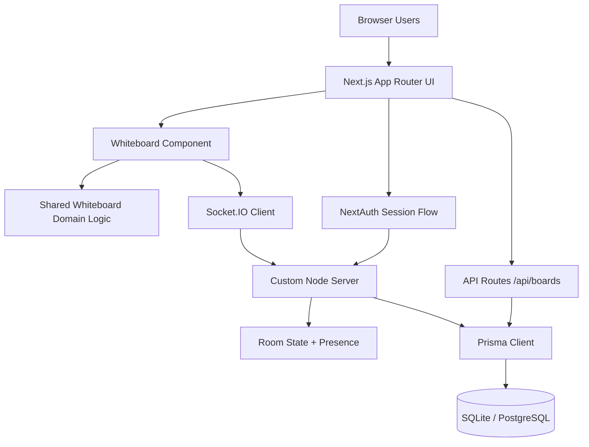
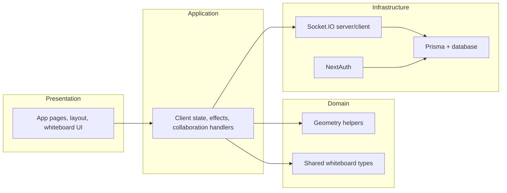
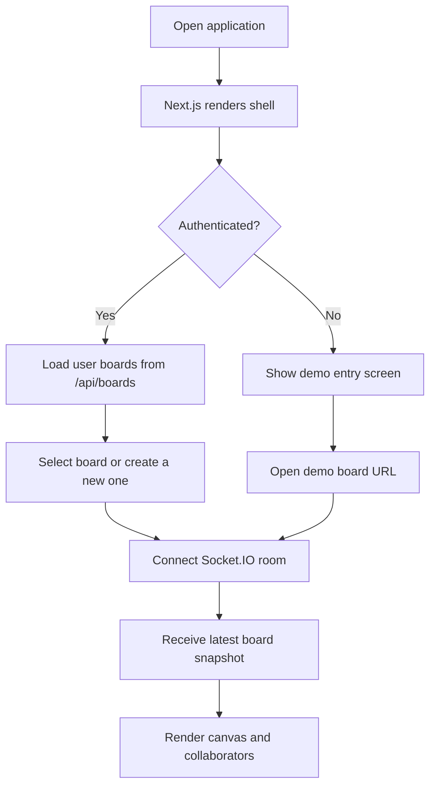
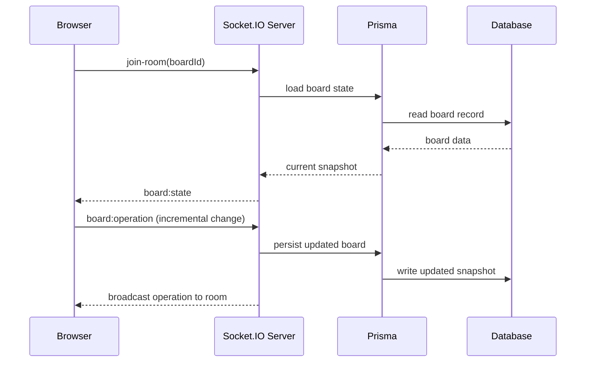
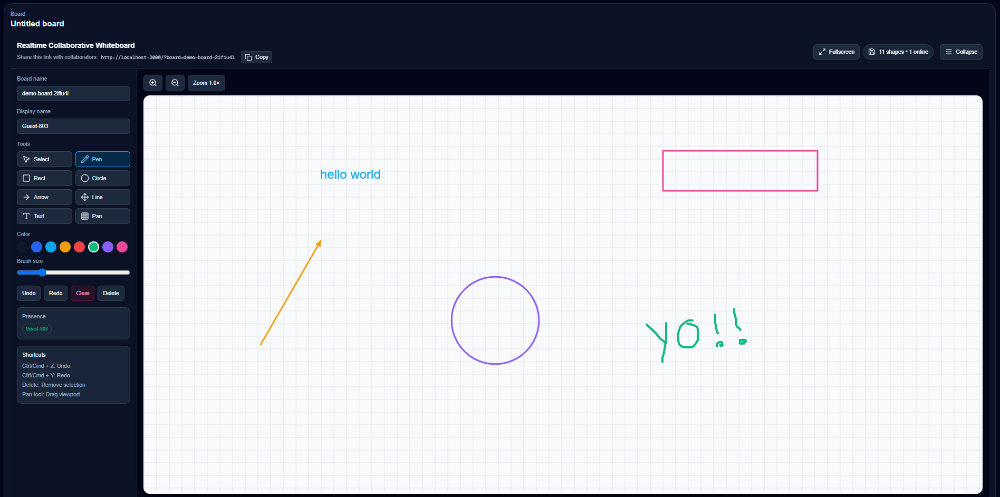

# Realtime Collaborative Whiteboard

A production-oriented real-time whiteboard for teams, interviews, demos, and collaborative workshops. It combines a custom Next.js server, Socket.IO, Prisma, and a canvas-based drawing surface to support shared editing, persistent board state, and a clean UI built for fast interaction.

## Table of Contents

- [Overview](#overview)
- [Problem Statement](#problem-statement)
- [Key Features](#key-features)
- [Tech Stack](#tech-stack)
- [Architecture](#architecture)
- [Execution Flow](#execution-flow)
- [Project Structure](#project-structure)
- [Installation](#installation)
- [Configuration](#configuration)
- [Usage](#usage)
- [API Documentation](#api-documentation)
- [Screenshots](#screenshots)
- [Performance, Scalability, and Security](#performance-scalability-and-security)
- [Testing and CI](#testing-and-ci)
- [Roadmap](#roadmap)
- [Contributing](#contributing)
- [License](#license)

## Overview

This project delivers a collaborative whiteboard experience where multiple users can draw, edit, and synchronize board state in real time. It is designed to demonstrate full-stack product thinking: interactive UI, persistent storage, authentication, collaboration semantics, and deployment readiness.

The application currently includes:

- A canvas-based drawing surface with pen, shapes, text, selection, move, resize, rotate, zoom, and pan controls
- Socket.IO-powered real-time board updates and presence indicators
- Prisma-backed persistence for board state and user-owned board records
- NextAuth integration for Google sign-in and board ownership workflows
- A modern responsive interface with shareable board URLs and demo mode support

## Problem Statement

Traditional screen-sharing does not scale well for collaborative design, teaching, whiteboarding interviews, or quick product planning. Teams need a shared surface that is:

- Fast to open and easy to understand
- Synchronized across users without manual refreshes
- Persistent so boards can be reopened later
- Secure enough to support authenticated ownership and board management
- Simple to deploy on modern hosting platforms with WebSocket support

This repository addresses that problem with a production-style real-time collaboration stack and a user experience optimized for both demos and practical team usage.

## Key Features

- Freehand drawing with a pen tool
- Rectangle, circle, arrow, and line creation
- Text insertion and object manipulation
- Select, move, resize, rotate, delete, and clear actions
- Undo and redo support
- Zoom and pan controls for larger boards
- Shareable board URLs for collaboration
- Presence indicators and cursor updates
- Persistent board state backed by Prisma
- Authenticated board creation, listing, updating, and deletion
- Demo mode for quick evaluation without signing in
- Responsive, dark-themed interface
- Docker-friendly runtime for deployment

## Tech Stack

- **Frontend:** Next.js App Router, React 19, TypeScript, Tailwind CSS, Lucide icons
- **Collaboration:** Socket.IO, shared room state, cursor/presence broadcasting
- **Persistence:** Prisma ORM, SQLite for local development, PostgreSQL-ready schema for production
- **Authentication:** NextAuth/Auth.js with Google OAuth
- **Validation and tooling:** Zod, ESLint, Vitest, Playwright, TypeScript
- **Runtime:** Custom Node server in `server.mjs`

## Architecture

The application uses a clean separation between UI, shared domain logic, API routes, and collaboration transport.



### Clean Architecture View



## Execution Flow

### App startup and board loading



### Collaboration and persistence flow



## Project Structure

```text
.
├── Dockerfile
├── README.md
├── server.mjs
├── prisma/
│   └── schema.prisma
├── public/
├── src/
│   ├── app/
│   │   ├── api/
│   │   │   ├── auth/
│   │   │   └── boards/
│   │   ├── globals.css
│   │   ├── layout.tsx
│   │   ├── page.tsx
│   │   └── providers.tsx
│   ├── components/
│   │   └── whiteboard/
│   │       ├── Whiteboard.tsx
│   │       └── Whiteboard.test.tsx
│   ├── lib/
│   │   ├── auth.ts
│   │   ├── prisma.ts
│   │   └── whiteboard/
│   │       ├── geometry.ts
│   │       └── types.ts
│   ├── setupTests.ts
│   └── types/
│       └── next-auth.d.ts
├── vitest.config.ts
├── eslint.config.mjs
└── next.config.ts
```

## Installation

### Prerequisites

- Node.js 20 or newer
- npm 10 or newer
- A database connection string for production use
- Google OAuth credentials if you want to enable sign-in

### Local setup

```bash
git clone https://github.com/ufoblivr/realtime-collaborative-whiteboard.git
cd realtime-collaborative-whiteboard
npm install
```

### Database preparation

This repository is configured to run locally with SQLite for convenience, while remaining compatible with PostgreSQL in production.

```bash
npm run prisma:generate
npm run prisma:push
```

If you prefer migrations:

```bash
npm run prisma:migrate
```

### Start the app

```bash
npm run dev
```

Open `http://localhost:3000` in your browser.

## Configuration

Create a local environment file from the example template:

```bash
cp .env.example .env.local
```

Recommended variables:

```bash
PORT=3000
NEXT_PUBLIC_SOCKET_URL=http://localhost:3000
NEXTAUTH_URL=http://localhost:3000
NEXTAUTH_SECRET=replace-with-a-long-random-string
DATABASE_URL=file:./dev.db
GOOGLE_CLIENT_ID=your-google-client-id
GOOGLE_CLIENT_SECRET=your-google-client-secret
```

### Notes

- Use `file:./dev.db` for local development.
- Switch `DATABASE_URL` to a PostgreSQL connection string for production.
- Set `NEXT_PUBLIC_SOCKET_URL` to the public HTTPS origin in deployed environments.
- Google OAuth requires the redirect URI `http://localhost:3000/api/auth/callback/google` in local development.

## Usage

### Demo mode

Use the landing page entry point to open a shareable board without authentication.

```text
http://localhost:3000/?board=demo-board-test
```

### Authenticated boards

1. Sign in with Google.
2. Create a board from the sidebar.
3. Share the board URL with collaborators.
4. Draw, edit, and watch updates propagate in real time.

### Practical workflow

1. Choose a drawing tool.
2. Add shapes, text, or freehand strokes.
3. Use select mode to move, resize, or rotate objects.
4. Undo or redo changes as needed.
5. Export, share, or reopen the board later through the persisted board record.

## API Documentation

The project exposes board routes through the App Router.

### `GET /api/boards`

- Returns the authenticated user's boards, ordered by most recently updated.
- Requires a valid NextAuth session.

### `POST /api/boards`

- Creates a new board for the authenticated user.
- Request body example:

```json
{
	"name": "Sprint Planning",
	"data": []
}
```

### `GET /api/boards/[id]`

- Returns a specific board by ID.

### `PATCH /api/boards/[id]`

- Updates a board's persisted drawing data.
- Requires the board owner.

### `DELETE /api/boards/[id]`

- Deletes a board.
- Requires the board owner.

### Response behavior

- `401 Unauthorized` for unauthenticated write operations
- `403 Forbidden` when a non-owner attempts to edit a board
- `404 Not Found` when a board does not exist

## Screenshots




## Performance, Scalability, and Security

### Performance

- Uses incremental socket operations instead of re-sending the entire canvas for every interaction.
- Keeps collaboration state room-scoped to reduce unnecessary broadcasting.
- Persists board snapshots so late joiners receive the latest state quickly.

### Scalability

- Socket.IO can be horizontally scaled with a shared adapter such as Redis when the project grows.
- Prisma keeps the persistence layer portable between SQLite for development and PostgreSQL for production.
- The custom server can be deployed on hosts that support WebSockets and long-lived Node processes.

### Security

- Board write routes require authentication and ownership checks.
- OAuth, session, and database configuration are isolated through environment variables.
- Production deployments should add rate limiting, stricter CORS policy, and input validation for socket payloads.

## Testing and CI

- Unit tests are configured with Vitest.
- GitHub Actions runs linting and tests on push and pull requests.
- The repository includes Playwright in the toolchain and is ready for end-to-end coverage expansion.

Continuous integration workflow: `.github/workflows/ci.yml`

## Roadmap

Planned improvements that would make the project stronger before or after publishing:

- Add Playwright end-to-end tests for drawing and two-tab collaboration
- Add export support for PNG, SVG, and JSON
- Add stricter socket payload validation with Zod schemas
- Add Redis-backed pub/sub for multi-instance Socket.IO scaling
- Add CORS and rate limiting for production hardening
- Add a visible auth error fallback when OAuth is misconfigured
- Add screenshots and a short demo GIF in `docs/`
- Add board sharing permissions such as view-only and edit access
- Add richer presence details and collaborator avatars
- Add CRDT-backed synchronization if true conflict-free merging becomes a priority

## Contributing

Contributions are welcome.

1. Fork the repository.
2. Create a feature branch.
3. Make your changes with focused commits.
4. Run linting and tests before opening a pull request.
5. Include screenshots or reproduction steps for UI changes.

Suggested verification commands:

```bash
npm run lint
npm test
npm run build
```

## License

This project is licensed under the MIT License. See the [LICENSE](LICENSE) file for details.
